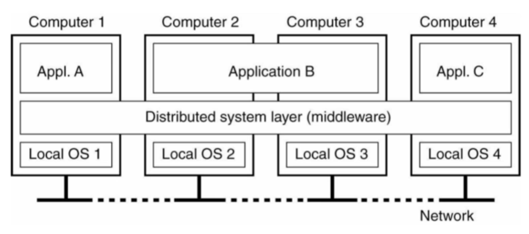
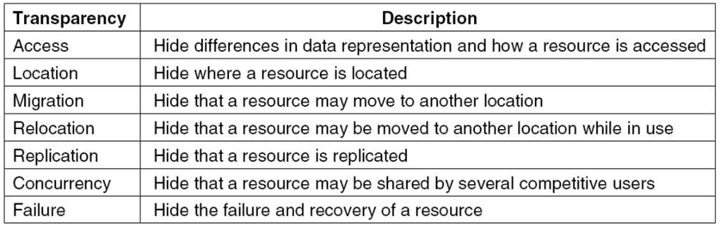

# [DS0_클라우드컴퓨팅수업개요] 정리
## 클라우드 컴퓨팅 (p.2)
특성
-	고객/사용자가 원할 때 서비스가 제공된다
-	네트워크를 통해 다양한 서비스를 얻을 수 있다
-	Pooling: 한 곳에 대규모의 자원을 모아 놓았다는 의미
-	빠르게 신축적으로 구현할 수 있다
-	사용한 양 만큼 과금을 하는 방식이다
컴퓨팅 패러다임의 변화
-	Main frame에서 모든 작업을 진행하는 방식
-	Parallel: 하나의 작업을 여러 개의 sub-task로 나누어서 한 컴퓨터에서 동시에 작업하여 빠른 시간에 완료하는 것이 목적
-	Distributed: 하나의 작업을 여러 컴퓨터에서 나누어서 작업하는 것, high-throughput 처리량

## 병렬 분산 처리 (p.3)
분산 시스템
-	개방성 openness 추구, 웹 기반
-	투명성 transparency: 복잡한 매커니즘을 개발자들이 보지 못하도록, 쉽게 접근할 수 있도록 제공한다는 의미
-	확장성 scalability: 컴퓨터 노드의 개수를 늘릴 수 있고 그것이 늘어남에 따라서 전체의 처리량 throughout이 Linear하게 증가될 수 있다 (실제로는 그렇지 않을 수도 있기 때문)
컴퓨터 시스템 구성
-	자치적인 컴퓨터 autonomous: 각 컴퓨터들이 임의로 접근할 수 있음 
-	고성능 병렬 컴퓨터 – 하나의 중앙 컴퓨터가 있어서 이 컴퓨터의 지시에 따라 작업

# [DS1_Introduction] 정리
Introduction of Distributed Systems
분산시스템의 정의, 특성, 유형

## 분산시스템의 정의 (p.2)
A loose characterization
-	독립된 자치적인 컴퓨터의 집합체가 사용자에게는 하나의 결합된 시스템으로 보여진다
Important characteristics
-	Heterogeneity를 숨겨준다 – 일반 사용자가 신경 쓰지 않아도 될 정보들을 숨겨준다
-	사용자와 어플리케이션이 상호작용을 하는데 항상 일정한 방법으로 접근할 수 있도록 한다
-	시스템의 규모를 확장시켜 동시에 더 많은 사용자들을 접근할 수 있도록 한다

## Middleware (p.3)
Common platform

## 목표 (1/4) (p.4)
여러 사용자들이 자원을 공유할 수 있도록 한다
경제성 제공, 그룹화, 보안 문제 발생

## 목표 (2/4) (p.5)
분산의 투명성을 제공한다

접근, 위치, 이주, 일시적 이주, 복제, 동시 접근, 서버 오류(접속 실패)
Trade-off가 필요하다

## 목표 (3/4) (p.6)
개방성
-	Interface definition: 서비스를 제공하는 컴포넌트에 접근하기 위한 파라미터를 제공하면 어떤 식으로 output을 내는지 정의하는 것
-	상호 운영 가능 하다 interoperability: co-exist 호환성
-	이동 가능성 porability: 한 시스템에서 실행하는 서비스가 수정없이 옮겨갈 수 있는가, 그대로 다른 시스템에서 이용 가능한가
-	확장/추가 가능성 extensibility

## 목표 (4/4) (p.7)
확장 가능한
-	규모(노드의 수), 지리적(지역 확대), 관리 주체(여러 주체가 관리할 수 있음)
c.f.)
중앙 집중된 알고리즘: 반드시 중앙에 거쳐가야 해결되게끔 설계한 것
Distributed 알고리즘: 코디네이터를 주지 않는 것, 사용자들이 서로 협의 하에 문제를 해결하는 것
	코디네이터: 여러 사용자들이 자원에 접근하려고 할 때 조정해주는 역할
중앙 집중되지 않은 알고리즘 -> scalablity를 높이기 위해
-	여러 기계가 일을 해결할 수 있도록 하는 방식
-	결정을 내릴 때에도 local information을 취합하여 (한 군데에서 일어나지 않는다)
-	한 기계의 실패로 인해 전체에 영향을 미치면 안된다
-	Global clock이 존재하지 않는다고 암묵적으로 가정한다 

Scaling techniques -> 오버헤드를 줄이기 위해
1.	Communication latency를 숨겨라 -  비동기 통신, 여러 개의 thread
2.	같은 데이터를 조회 해야하는 경우에 분산시켜라 – ex) DNS, 대기 시간을 줄이기 위해 dns 서버를 여러개 두고 가장 가까이 있는 것을 사용
3.	복제 - ex) 캐싱
사용자 수가 늘어남에도 성능, 시간을 유지할 수 있도록 하는 방법

## 분산 시스템의 유형 (p.8)
1.	분산 컴퓨팅 시스템 (연산 양을 늘이기 위해)
-	클러스터 컴퓨터 시스템
  * 동일한 기준의 컴퓨터들을 묶어놓은 것
  * 사용자에게는 하나의 시스템처럼 보이게 하는 것
-	그리드 컴퓨팅 시스템
  * 각 기관이 가지고 있는 자원을 유효 시간에 내놓는 방식으로 고도의 이질성 heterogeneity을 지닌다
  * 가상의 기관
2.	분산 정보 시스템 (많은 사용자의 업무를 처리하기 위해)
-	Transaction processing systems
  * Transaction 거래: 계좌 이체 시 여러 작업이 필요한 것
  * 일련의 작업을 모두 완수해야 함
  * ACID: atomic, 일정한 결과값 consistent, 순차적 isolated/serializable, 지속적 durable
-	Enterprise application integration 기업에서 사용하는 
  * RPC(원격지에 있는 프로시저를 호출)/RMI remote method invocations, 다른 기계에 request를 보내 처리 
  * 메시지 기반 (서로 주고 받음) 
3.	분산 pervasive 시스템
-	IoT, ubiquitous
-	센서 통신

## 1주차 과제
[1주차 과제 바로가기](https://github.com/jaehui327/CloudComputing/tree/master/Week01/report)

