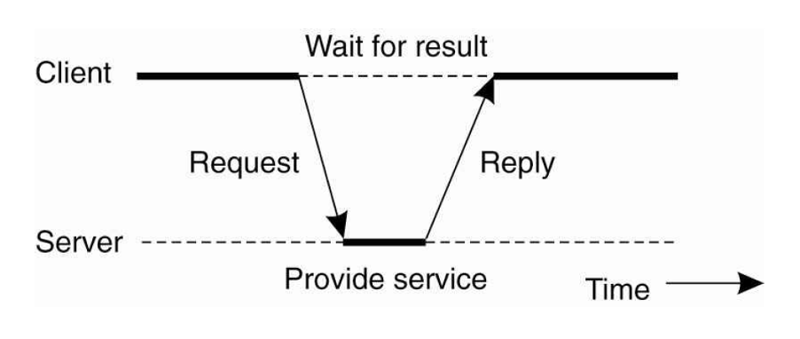

# 2주차 과제
## 분산 시스템 아키텍처인 클라이언트/서버 아키텍처와 P2P 아키텍처의 차이점을 설명하고 각각의 장단점을 논하시오.

### 분산 시스템 아키텍처인 클라이언트/서버 아키텍처와 P2P 아키텍처의 차이점
#### 클라이언트/서버 아키텍처

클라이언트가 서버에 요청(request)을 보내면 서버는 일을 하고 클라이언트가 원하는 작업 결과를 응답(reply) 형태로 제공하게 됩니다. 일반적으로 클라이언트는 요청을 보내고 해당된 응답이 올 때 까지 대기(wait)하는 형태로 통신이 이루어지게 됩니다. 특징 중 하나로는 idempotent, 즉 같은 클라이언트가 동일한 요청을 했을 때 해당 응답 값은 같다는 것입니다. 그러나 그렇지 않은 경우도 있습니다. 예를 들어 클라이언트가 전화를 한 번 할 때 마다 기부금을 1000원 받는 시스템 등이 있습니다. 이게 중요한 이유는 서버를 설계할 때 idempotent할지 하지 않을 지에 따라서 클라이언트의 중복된 요청을 처리하는 것이 달라지기 때문입니다. 웹 기반에서 클라이언트가 서버에 요청을 보낼 때 여러 번 클릭했을 경우 등에서 처리 방식에서의 차이가 생깁니다.   
**클라이언트 서버 아키텍쳐는 중앙 집중된 형태라고 볼 수 있습니다. 이에 반해 중앙 집중 형태가 아닌 p2p 아키텍쳐의 특징은 다음과 같습니다.**

#### P2P 아키텍쳐
소프트웨어 컴포넌트들이 일을 수행할 때 수직적이 아니라 수평적으로 쪼개어 여러 peer computer들이 나눠 갖게 하는 방식이라고 할 수 있습니다. 여기서 ‘peer’는 클라이언트와 서버 간의 규모 등이 큰 차이 없다는 의미의 ‘동료’로 쓰이게 됩니다. 따라서 서버의 역할과 클라이언트의 역할의 분리하지 않고 모두가 나누어서 수행하는 방식입니다. Overlay Network, 즉 기관이 가지고 있는 네트워크 배치도, 통신 사업자들이 운영하는 네트워크 설계도 등 여러 개의 네트워크가 겹쳐져 있는 구성도를 하나로 겹쳐 보다 보면 출발지에서 목적지까지c의 경로를 찾을 수 있게 됩니다.  
 정형화된 P2P 아키텍쳐와 비정형 P2P 아키텍쳐로 나눌 수 있는데, 트리, 매쉬 등의 정형화된 형태를 지니느냐에 따라 나누어지게 됩니다. 비정형 P2P 아키텍쳐 같은 경우는 앞에서 말한 overlay network 형태를 지니게 됩니다.   
 

### 클라이언트/서버 아키텍처와 P2P 아키텍처의 장단점
#### 클라이언트/서버 아키텍처
-	**장점**  
인터넷 서비스에서 가장 일반적인 형태로 중앙에서 관리하는 강력한 컴퓨터가 상대적으로 빈약한 사용자 컴퓨터에 서비스를 제공해주는 형태를 지닙니다. 정보를 제공해준다는 의미로 서버, 정보를 활용하는 고객이라는 의미에서 클라이언트로 불리게 되었습니다. 
서비스의 구성이 직관적이기 때문에 서비스를 변경하기 위해서는 서버만 교체하면 된다는 장점이 있습니다. 이러한 장점으로 콘텐츠 관리 측면에서 수정 등이 용이하게 됩니다. 

-	**단점**  
중앙 집중 방식의 취약점인 서버의 과부하로 인한 영향을 단점으로 꼽을 수 있습니다. 서버 컴퓨터 자체 또는 다중의 서버가 연결되어 있는 네트워크에서의 문제가 생기면 서비스 자체가 다운될 수 있게 됩니다. 이러한 문제는 하드웨어 업그레이드를 통해 해결할 수 있게 됩니다.  
좋은 부품을 사용할 수록 단점을 극복할 수 있으나 이는 높은 관리 비용이 든다는 단점을 또 초래하게 됩니다. 물리적인 장비의 역할이 크기 때문에 생기는 단점이라고 볼 수 있습니다.  

 

#### P2P 아키텍처
-	**장점**  
사용자(peer)가 다른 사용자(peer)에게 데이터를 전송해주는 방식이기 때문에 서버 역할을 하는 컴퓨터가 반드시 월등한 사양을 지녀야 하는 것은 아닙니다. 간단한 방식만으로 서버가 될 수도 있고 클라이언트가 될 수도 있다는 것이 장점입니다. 
 하나의 컴퓨터가 중앙 서버가 되어 관리할 필요가 없다는 것이 장점입니다. 따라서 서버의 과부하나 네트워크의 오류에서도 대응하기 용이하게 됩니다. 
-	**단점** 
그러나 사용자가 다른 사용자가 가지고 있는 데이터를 원할 때 그 해당 데이터를 항상 얻을 수 있는지, 빠른 시간 안에 얻을 수 있는지에 대한 성능에서는 문제점이 있습니다. 모든 사용자가 서버 또는 클라이언트가 될 수 있으므로 신뢰성과 효율성에서의 단점이 생기게 됩니다. 

 

##### 참고 문헌
[P2P vs 클라이언트-서버 모델, 각각의 장단점은?(2016.07.13)](http://www.inven.co.kr/webzine/news/?news=160006) 
[냅스터부터 P2P까지, PC와 모바일의 클라이언트-서버 모델(2016.09.21)](http://www.inven.co.kr/webzine/news/?news=164068)

