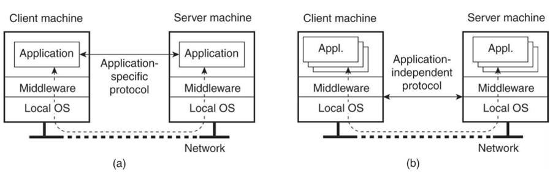
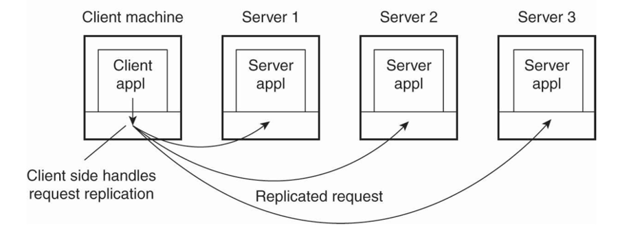
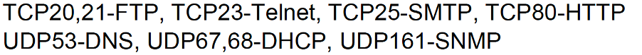
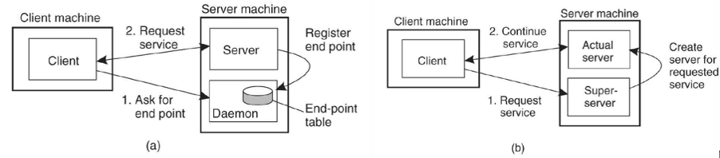
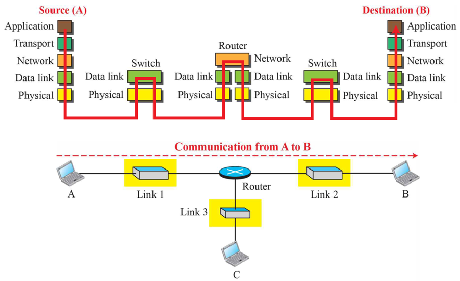
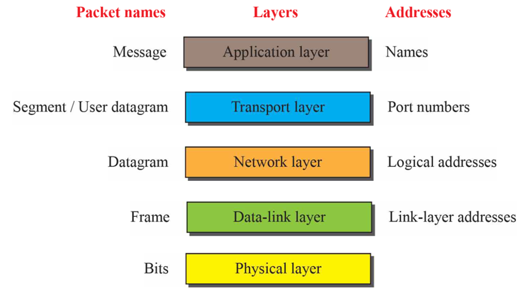
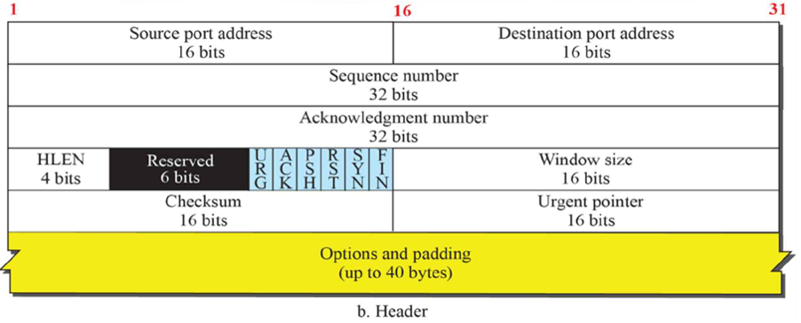

# DS3_Processes
## Clients(1) (p.10)
  
Client-server 환경  
(a): application간에 사용하는 프로토콜이 specific 함, 통용되지 않고 한 애플리케이션 간에서만 유효한 프로토콜을 사용하는 경우이다. 애플리케이션 간의 직접 연결

* 장점: 성능을 높일 수 있다. -> 해당 애플리케이션에서 필요한 기능만 사용할 수 있기 때문에 부수적인 데이터 양, 시간 등을 단축시킬 수 있어서
* 단점: 특정 애플리케이션 간에서만 작동하기 때문에 분산 시스템이 추구하는 개방성, 이동성, 유연성이 부족하다
(b): 미들웨어 상에서 프로토콜이 진행. Independent – 표준화된 방식으로 클라이언트-서버 통신을 진행하는 방식이다.
* 장점: 유연성, 이동성, 개방성. 어떤 애플리케이션이든 간에 특정 위치에 국한되지 않고 자유롭게 이동해갈 수 있다
* 단점: 불필요한 프로토콜(데이터), 추가적인 오버헤드, 전송 시간 지연

## Clients(2) (p.11)
분산의 투명성을 제공하기 위한 Client-side software  

복제 서버를 둠. -> 성능, 신뢰도를 높이기 위해서 
`Stub`: 그루터기, 극장 티켓을 내고 남은 절반 
Client application와 server 사이에서 client가 할 일을 대신해주는 모듈 
데이터를 보낼 때 서버가 복제되어 있기 때문에 복제된 개별적인 서버에 통신해야 하는데 이를 사용자가 모르게 투명성을 제공하고 stub이 알아서 처리해줌 

## Servers(1) (p.12)
Service port (end point) 
Client가 server에 request를 전달하기 위해서는 server의 IP 주소와 tcp/udp 포트번호(16)를 알아야함  

 

**(a)	Daemon**  
서버에 special background process 
클라이언트가 daemon process를 통해 end point를 알아내서 Request를 다시 보내는 방식으로 client에 부담이 어느정도 있음 
**(b)	Super-server**  
여러 서버 중 super 서버에 요청. Dispatch 
클라이언트에는 별도의 절차가 없이 super server가 처리하게 된다! 부담이 적음 

## Servers(2) (p.13)
* Stateless
클라이언트가 누구이고 어떤 일을 처리하는지에 대한 상태 정보를 저장하지 있지 않은 서버. 
일반적인 웹서버. 웹서버와 같이 많은 정보를 가지고 있어야 하는 경우에는 상태 정보를 계속 유지하는 것이 적합하지 않기 때문이다. 
고객을 계속해서 못 알아보면 불만이 생길 수 있다.  
`Cookie`: stateless의 한계를 보안하기 위해 서버가 클라이언트에 관련된 정보를 클라이언트의 브라우저에 정보를 저장해 둔다. 다음에 클라이언트가 서버에 요청할 때 쿠키를 가지고 오면 state 정보를 알아볼 수 있게 된다.  
만들고 보는 것 모두 서버지만 클라이언트의 브라우저에 저장한다는 것이 특징 
개인정보와 관련된 보안의 취약점이 있음. 
* Stateful
클라이언트에 대한 지속적인 정보를 유지하고 있는 서버 
서버가 연결 끊어지면 사용자의 상태를 가지고 있다가 재개가 됐을 때 문제가 생기기 이전의 상태로 유지할 수 있도록 해준다. 비용 부담이 있을 수 있음. 
`Soft state`: 부담을 줄이기 위한 절충안. 세션 기간, 짧은 시간 등 제한된 시간 동안만 유지 

## Code Migration(1) (p.14) 
데이터를 처리해주는 실행 코드(서버가 가지고 있음)의 이주 
`Mobile agent`:   
데이터의 양이 많거나 분산되어 있는 정보를 처리할 경우에는 모든 정보를 서버에서 가져오는 것보다 데이터를 menu plate 하기 위한 작은 코드가 여러 사이트들을 방문하면서 결과값을 읽어오는 것이 효율적일 수 있다.  

##Code Migration(2) (p.15) 
-	Weak mobility
-	Strong mobility
 

## Code Migration(3) (p.16)
**코드가 실행될 때 필요한 Resource에 따라서 결합도(binding)가 달라짐 -> mock up 여부**  
* Unattached: 이동해갈 수 있음 ex) data
* 어려움 ex) DB, web site
* Fixed ex) device
  
**모바일 코드가 일어나게된 배경** 
Simple network management protocol  
네트워크 관리자가 여러 장비들에 대한 상태 정보들을 가져오는데 이런 경우에 정보를 요청할 때 필요한 연산이 많다. 이때 트래픽이 발생하는 것을 감당하기 위해 합산을 하기 위한 코드를 네트워크 장비들에게 투어를 시킴  

## Summary (p.17)
효율성을 따지기 위해 
병렬성을 주기 위해 
클라이언트/서버에서의 효율성 
  

# Communication
분산 시스템을 구성하는 애플리케이션 컴포넌트들 간의 통신이 어떤 식으로 이루어질 수 있는가

## Introduction (p.2)
-	프로세스간 통신: low-level 메시지 패싱 (소켓 통신, TCP/IP 프로토콜) or high-level middleware (remote procedure call)
-	프로토콜의 성격을 잘 이해해야 함
-	RPC
-	메시지 기반 통신 
1) transient: 보내고 받는 상대방이 active한 상태 일 때만 통신 Ex) socket 통신 등 
2) persistent ex) e-mail 등
-	스트림 기반 통신: 동기화 문제
-	`멀티 캐스트`: 시스템 그룹들 간에 reliable하게 메시지를 받을 수 있도록 보장하기 위한 기술 ex) 단톡방 – 모든 인원이 동일한 순서로 동일한 메시지를 받을 수 있어야 함.
 

## Layered Protocols (1) (p.3)
* OSI model 7계층
단점: 오버헤드가 많다 
장점: 모듈을 원하는 것으로 선택 가능하다. ex) 전송 계층에 해당하는 tcp/ip 선택 가능 
* 프로토콜
-	커넥션 기반: 홀을 설정 ex) 전화 – 대기, TCP
-	커넥션 지양: 일방적으로 메시지 전달, 사전에 set up 과정 없이

## Layered Protocols (2) (p.4)
-	Protocol suite (protocol stack): 부가적인 헤더/트레일러 등의 메시지가 붙는 것 – 오버헤드
-	Low-level
  * 물리 계층: 비트 신호를 보낸다. Ex) RS-232C
  * 데이터링크 계층: 이더넷 프로토콜. CSMA(carrier sencing multiple access)/CD(Collision Detection: 한 스테이션이 다른 곳으로 데이터를 보낼 때 전깃줄을 통해 감.) 프로토콜  
  * 네트워크 계층
    * IPv4: connectionless
FCS Frame Check Sequence: 4bit 

## Layered Protocols (3) (p.5)
* 전송 계층
  * TCP: connection oriented 양방향 통신, 16비트 포트 주소, reliable 신뢰할 수 있으나 오버헤드가 많음
  * UDP: connectionless, 간단한 메커니즘. 쉽고 간단하지만 신뢰성이 낮음
  * RTP: 실시간
* Middleware protocols: `인증`, `transaction(이체)` `atomic` (한 덩어리로) -> 중간에 문제가 생기면 해당 지점으로 다시 원위치, `locking` (여러 사람이 동시에 접속할 경우 lock을 획득해야 함, 끝나고 나면 반납. )

## Types of Communication (p.6)

<ol>
<li>Persistent (e-mail)</li>
메시지가 지속적으로 사라지지 않는 경우 
<li>transient</li>
상대방이 active하지 않는 경우에는 메시지가 전송되지 않음</ol>
 

<ol>
<li>synchronous 동기</li>
대기 후 상대방의 응답이 오면 메시지를 전송하는 방식 
Wait 시간이 길어질수록 성능이 떨어질 수 있음. 
<li>asynchronous 비동기</li>
오버헤드를 줄일 수 있는 방법 중 하나</ol>
 

# DS4a_TCP_IP (Transmission Control Protocol / Internet Protocol)
## 인터넷 프로토콜 (TCP/IP) (p.2)
계층 구조, 주소 지정을 해줌 
-	TCP: 흐름 제어, 오류 제어
-	IP: 데이터그램 – connectionless: 각자 알아서
  
## 인터넷 계층 구조 (p.3)

## TCP/IP 계층 논리 연결 (p.4)
라우터 
-	IP 패킷이 오면 해당 패킷의 출발지/목적지 주소가 있음. 가까운 쪽으로 패킷을 이동

## 캡슐화와 역캡슐화 (p.5)
오버헤드 
계층 구조에서 애플리케이션이 전달하는 메시지가 상대방에게 어떻게 전달되는가 
 
**메시지**
-	애플리케이션 단에서 상대방에게 전달하는 것
-	메시지를 전달할 때 편지지를 봉투에 담아서 보내는 것 -> 캡슐화
-	데이터링크에서는 trailer도 붙게 됨
 

## TCP/IP 프로토콜 주소 지정 (p.6)
상대 오브젝트를 unique하게 지정해야 하는 경우 중요한 것이 **Address**
 
Mac 주소와 IP 주소를 연결해주는 ARP 프로토콜 
 

## TCP 서비스 (1) (p.7)
-	Process-process 통신
-	스트림 배달 서비스
스트림이란 연속된 데이터를 의미. 바이트 단위로 생성(쓰기)/소비(읽기) 
-	송신 버퍼와 수신 버퍼

## TCP 서비스 (2) (p.8)
데이터 단위: 세그먼트를 버퍼에 write 
연속된 스트림을 바이트 단위로 버퍼에서 처리함, 양방향 통신이 가능하다 
 

## TCP 서비스(3) (p.9)
-	Full-duplex 전이중 서비스
-	연결 지향 서비스: 3-way-handshaking
-	Reliable 서비스
 

## TCP 특징 (p.10)
-	순서 번호 sequence number와 확인 응답 번호 acknowledgment number 사용
-	바이트 번호는 흐름 및 오류 제어에 사용
-	sequence number: 보내려는 데이터의 첫번째 바이트 번호
-	acknowledgment number: 수신하기를 기대하는 바이트의 번호
 

## TCP 세그먼트 (p.11) – 헤더

Window size: 받을 수 있는 데이터의 바이트 크기 

## 네트워크 계층 (p.12)
Internet control message protocol

## IPv4 데이터그램 (p.13)
Identificaion 일련 번호를 가짐으로 데이터를 올바른 순서로 보낼 수 있게 된다. 
Fragment: 단편화.Router에 따라 단편화해야하는 경우가 생길 수 있음 
 

# 3주차 과제
[3주차 과제 바로가기](https://github.com/jaehui327/CloudComputing/tree/master/Week03/report)

