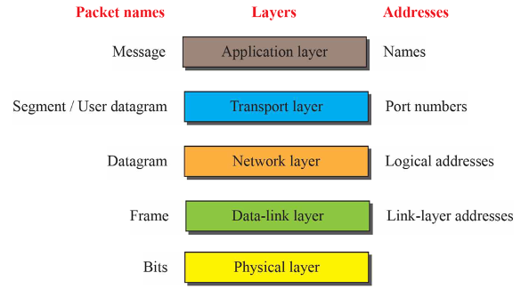

# 3주차 과제
## 각자의 컴퓨터에서 웹(HTTP)으로 학교 홈페이지에 접속하여 웹페이지를 요청하는 경우, 인터넷 계층(응용에서 데이터링크까지)에서 사용하는 주소를 파악하고 주소의 처리방법을 설명하시오.

* 주소 / 주소 처리 방법  
각 계층에서 사용하는 주소를 파악해보면 `응용 계층`에서는 통신 수단의 이용자 위치에 있으면서 통신 처리를 담당하는 계층으로 HTTP 프로토콜을 채택하는 역할을 한다. `사용자 지원 계층`이라고 불린다.    
응용 계층에서 프로토콜을 정했다면 다음으로 `전송 계층`에서는 전송 방식을 정한다. 헤더에는 `송/수신지 포트 번호`를 포함하여 올바르게 전달될 수 있도록 한다. 프로세스 수준의 주소 지정, 다중화/역다중화, 연결, 분할과 재조합, 승인과 재정송, 흐름 제어 등을 담당한다.    
전송방식 결정 후 `네트워크 계층`에서는 실제 전송을 담당하게 된다. 상위 레벨 데이터는 패킷 안으로 캡슐화 되며 패킷 헤더는 패킷의 `송신지와 수신지의 논리 주소`를 포함하는 필드를 가진다. 논리적 주소 지정, 라우팅, 데이터그램 캡슐화, 단편화와 재조합, 에러 처리와 진단 등을 맡는다.   
다음 `데이터링크 계층`에서는 인접한 통신 장치간의 신뢰성 있는 정보 전송을 보장하는 역할을 한다. 논리적 연결 제어, 매체 접근 제어, 데이터 프레이밍, 주소 지정, 에러 탐지와 처리, 물리 계층의 요구 사항 정의 등의 역할이 있다. `링크 계층의 주소`를 사용하게 된다.   
마지막 `물리 계층`은 전기적/기계적 수준에서 네트워크를 통해 전달하는 계층으로 인코딩, 신호처리, 물리적 데이터 전송, 하드웨어 명세, 토폴로지 설계 등의 역할이 있다.   
 

### 참고문헌   
[OSI 7계층이란?(2018.08.15)](https://shlee0882.tistory.com/110) 
[OSI 7계층 (OSI 7 Layer)(2017.09.29)](https://atin.tistory.com/619) 
[Internet 5 Layer (인터넷 5계층)(2011.06.30)](https://m.blog.naver.com/PostView.nhn?blogId=takakobj&logNo=110112202414&proxyReferer=https%3A%2F%2Fwww.google.com%2F) 