# DS4_Communication
중간고사 보기 힘들 수도 있음. 따라서 과제가 성적 처리에서 비중이 클 것으로 예상.

## Basic RPC Operation (p.7)
프로시저를 호출한다는 것: C언어에서 count = read(fd, buf, nbyptes); -> local 프로시저 콜 (같은 컴퓨터 내에서 실행되고 있는 프로시저를 호출하는 방식) 
Call-by-value or call-by-reference  

**RPC Remote Procedure Call**: 원격지에 있는 프로시저를 호출 
파라미터를 전달할 때 메모리 주소를 참조하도록 하는 것은 불가, 값을 넘겨야함  
**Stub**: 클라이언트의 애플리케이션을 대신해서 분산의 투명성을 제공해주는 소프트웨어 모듈 
Local or remote 구분할 수 없도록 stub이 대신 처리해줌 
Client가 보내온 request message를 unpack (해체) 해서 server로 보낸다.  

## Parameter Passing in RPC (p.8)
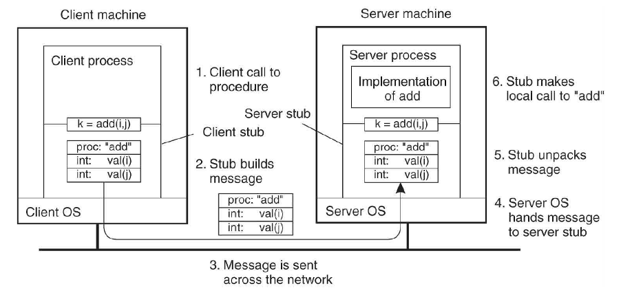
Local에서 처럼 k = add(I, j) 로 사용 
* Parameter `marshaling`: 한 줄로 맞추어 나열해서 세우는 것, 표준화/구조화 되어 있는 데이터들을 `packing`하는 것
* Interface: add에 integer형태의 파라미터가 2개가 있다고 알려주는 매개 역할
서버는 클라이언트가 호출할 수 있도록 정의 해놓은 인터페이스를 공개함 
클라이언트는 인터페이스를 가져다 컴파일 시 링크해서 사용 
IDL은 Type 정의도 중요 
  - Static interface: 애플리케이션을 컴파일 할 때 같이 컴파일해서 stub으로 만들어 놓는 것, 개발 할 당시 어떤 것을 호출할지 알고 있기 때문에 미리 가져다가 놓을 수 있음
  - Dynamic interface: 동적으로 런타임에 호출할 수 있도록 서버의 프로시저의 인터페이스를 가져다가 그 stub을 실행시간 중에 메시지를 만드는 방법, 개발할 당시 프로시저 콜을 할지 예상을 못했을 때 

## More on RPC (p.9)
### Asynchronous RPC
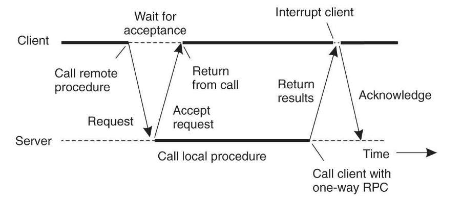
Request처리 전 request를 올바르게 받았다는 메시지를 보낸다. 일하는 동안 시간이 걸리더라도 reply가 올 것을 예상할 수 있도록 한다. 
Acknowledge: 서버가 결과값을 저장해야 하는 경우, 올 때 마다 처리하는 것이 아니라 history를 저장해두고 결과값만 재전송해주는 용도로 사용할 수 있음 -> traffic이 발생하지만 효율 가치가 있음 -> 1. 접수했다는 사실을 알려줌으로써 클라이언트의 대기 시간을 효과적으로 사용할 수 있도록 함, 2. acknowledge를 사용함으로서 서버 history의 양을 줄여줄 수 있음  

### Example of RPC
1980년대 후반 
1990년대 DCE by OSF 
MicroSoft DCOM을 기반으로 
2000년대 객체지향 RMI  

## Message-Orient Transient Communication (p.10)
Socket: unix inter-process ### endpoint, 전송 계층에서 제공하는 primitive(API)를 이용해서 
IP Adress, tcp port number를 소켓에 묶어서 바인딩  
요청이 있는가 listening을 하고 있음 
3-way-handshaking -> syn, ack -> ack   

## Sockets (p.11)
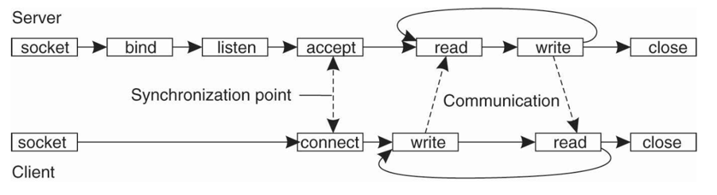
양방향으로 메시지를 주고 받음 
일시적인 통신 
분산 시스템에서는 low level, wrong level of abstraction  

## Message Passing Interface (p.12)
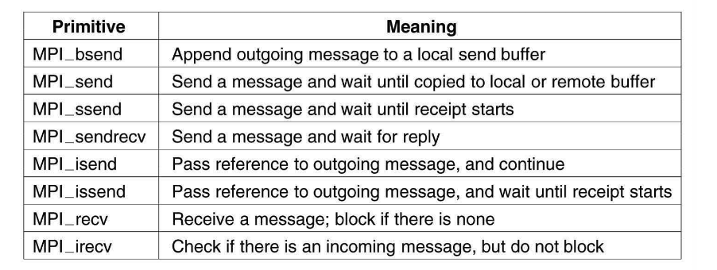
진정한 메시지 패싱 primitive 

## Message-Oriented Persistent Communication (p.13)
메시지를 보내는 쪽과 받는 쪽이 모두 active한 동작을 하고 있는 상태에서만 통신이 가능한 상태 
e-mail 
Put: queue에 message 보관 
Get: 읽어옴 
Poll: 체크 
Notify: 알림  

## Stream-Oriented Communication (p.14)
* 동기 전송 모드: 보내는 쪽에서 한바이트 -> 받는 쪽에서도 한바이트, 같은 시간 간격을 가지고 전송하는 방식 -> 일반적으로 불가능함  
* 비동기 전송 모드: 왕창 받고 왕창 보내고
* Isochronous 이등변 전송 모드: 일정한 시간 (5초, 10초) 동안의 컨텐츠를 보내고 받는 방식, 보내는 시간이 일정한 시간 간격 동안에 일정한 데이터를 보내면 받는 쪽에서도 그 데이터를 받을 수 있도록 보장해주는 방식
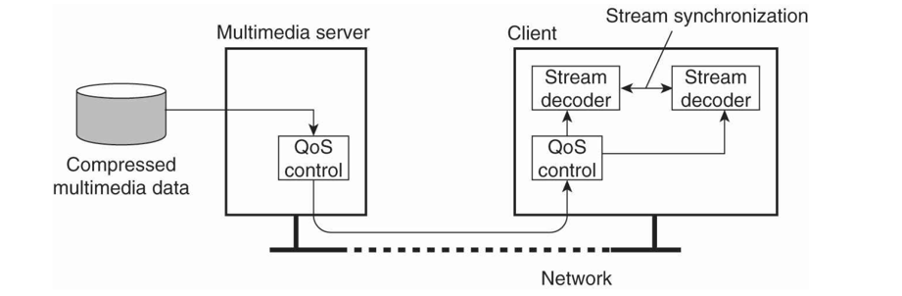

동기화는 영상의 퀄리티와 관계가 있음 

## Multicast Communication (p.15)
분산 시스템에서 꼭 필요한 것 
그룹들 간에 서로 같은 메시지를 주고 받는 형태  

브로드캐스팅 (한사람이 모든 사람에게), 유니캐스트 (일대일), 멀티캐스트 (그룹 멤버끼리)   

* 유용성
  - Fault-tolerance: TMR
  - Locating objects: 어디있는지 몰라서 그룹 멤버들에게 물어보는 것
  - Replicated data for performance: 퍼스먼스 목적으로 데이터가 복제되어 있는 경우
  - Multiple update (event notification)
* Atomicity: 멀티캐스팅 메시지를 보내면 모든 그룹 멤버가 받을 수 있어야 함
* Ordering: n개의 노드들이 동일한 순서로 멀티캐스팅 메시지를 받을 수 있어야 함
* Reliable Multicast
  * Holdback: 멀티캐스트 메시지가 오면 커뮤니케이션 핸들러라는 디바이스가 가지고 있다가 전송하는 노드로부터 컨펌 메시지를 받으면 전달해주는 것
  * Negative acknowledgement: 연속된 일련 번호를 멀티캐스트 메시지에 보내는 것
* Totally ordered atomic multicast
  * Timestamp
  * Sequencer process
  * An id-generation protocol among processes 

# DS4b_Multicast
## Holdback (p.1)
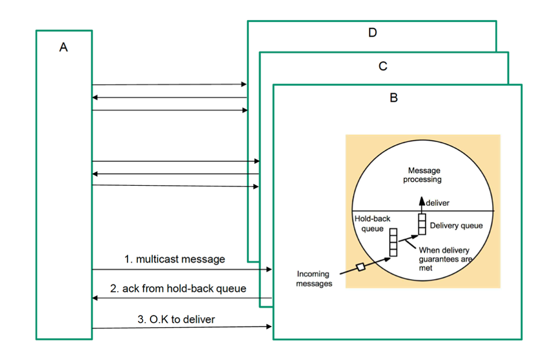

## Negative acknowledgement (p.2)
무소식이 희소식 
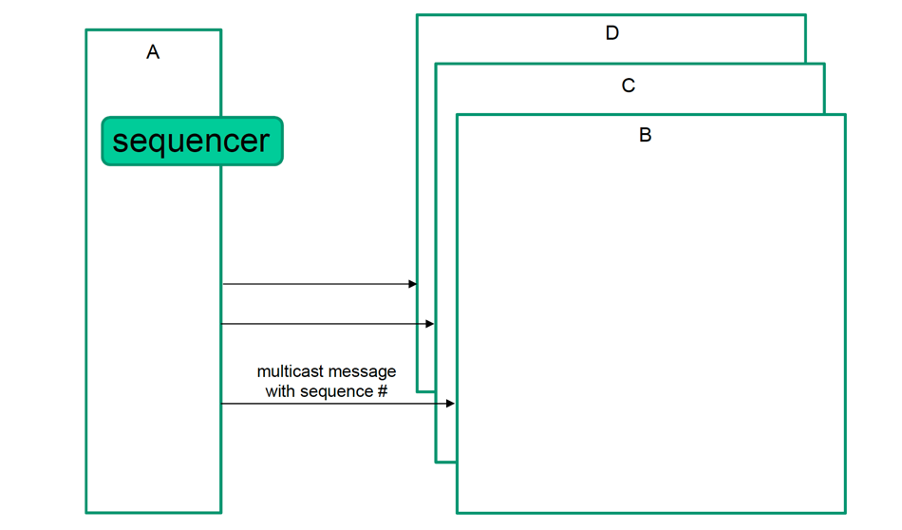

# DS4c_CORBA
오브젝트 기반 환경 표준안
OMA Object Management Architecture 
* ORB Object Request Broker
모든 오브젝트들이 연결이 되게끔 하는 통로를 제공 
* CORBAservices, CORBAfacilities
응용들을 손쉽게 개발할 수 있도록 제공 

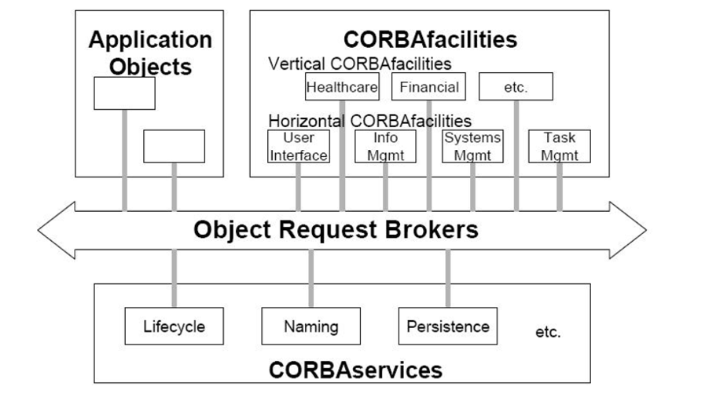

ORB가 전체 코바 시스템의 버스와 같은 형태로 묘사
### 연결 통로 제공

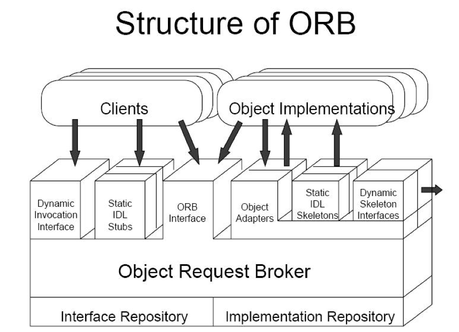
Client들이 서버 Object들에게 request를 보내고 반대로 reply를 보내는 연결 통로를 제공하는 것이 Object Request Broker 
ORB Interface를 통해서 클라이언트와 오브젝트 임플리멘테이션이 서로 메시지를 주고 받는다.
* Interface 사용
  - Interface Repository: Object Implementations을 개발한 사람이 IDL로 기술한 인터페이스 저장한다. 클라이언트가 인터페이스를 가져다가 본인의 프로그램과 링크를 해서 static IDL Stubs을 미리 만들어 놓는다. -> 분산의 투명성을 제공, 마샬링, 클라이언트 별로 여러 개가 생성된다.
  - Dynamic Invocation Interface: 사전에 stub 만들어져 있는 것이 아니라 실행 시간 중에 interface repository에서 interface를 가져다가 동적으로 request message를 만들어 주는 역할
  - Object Adapters: 서버 기기에 있는 Object Implementations에 대한 생명주기를 관리해주는 역할, 어떤 Implementation이 활성화 되어 있는지, 그것이 어느 기기에 있는지, Implementation에 대한 정보를    Implementation Repository에 저장을 해둠. Request message를 만들 때 해당되는 implementation 구현물이 어디에 있는가를 알기 위해서 참조. 주소값을 알아냄.   

**Client Structure and IDL Stubs**  

**CORBAservices** 
**CORBAfacilities**  

### Client Structure and IDL Stubs
* Client accesses object implementations through their IDL interfaces
* Specifying the target object instance via its object reference
* IDL interface isolates the client from the object’s implementation details
* Client-to-stub interface is defined by the standard OMG language mapping
* Stub-to-ORB interface is proprietary
* Invocations via SII are synchronous (unless oneway)  

### DII (Dynamic Invocation Interface)
* Gives a client the capability, at any time, of invoking and operation on any object that it may access over the network 
* Allows deferred synchronous, nonblocking with return result 
* 4 steps to a dynamic invocation
  * Identify the object
  * Retrieve its interface
  * Construct the invocation
  * Invoke the request and receive the results  

### IR (Interface Repository)
* Each ORB bears and implements the IR interface, allowing the IDL definitions for all of the objects it knows about to be stored, modified, and retrieved
* 3 ways ORB can use IR
  * To provide interoperability between different ORB implementations
  * To provide type-checking of request signatures, whether a request was issues through the DII or through a stub
  * To check the correctness of inheritance graphs
* Identifying and IR
  * A particular IR may be shared by more than one ORB
  * And ORB may access more than one IR
  * Each IR has its own unique Repository ID  

### BOA (Basic Object Adapter)
* Generation and interpretation of object references
* Activation and deactivation of object implementations
* Activation and deactivation of individual objects
* Method invocation via skeleton 

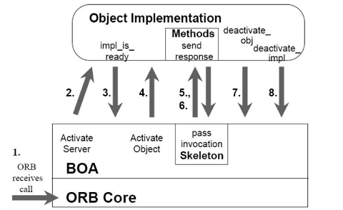
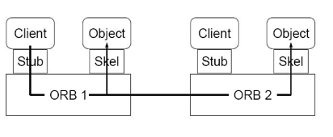  

### CORBAservices
* Lifecycle and Relationship services
* Persistent Object and Externalization services
* Naming and Trader services
* Event Services
* Transaction and Concurrency services
* Property and Query services
* Security and Licensing services  

### CORBAcacilities
* Horizontal CORBAfacilities
  * User interface
  * Information management
  * System management
  * Task management
* Vertical CORBAfacilities
  * Healthcare
  * Telecommunications
  * Financial services  

### Remote object model
  * Object hosted by server 
  * Clients allowed to do method invocations
### DS issues
  * Communication
  * System-wide object referencing
  * Entry consistency
  * Fault-tolerance
  * Security  

### 클라이언트 구조 및 IDL 스텁
  * 클라이언트는 IDL 인터페이스를 통해 객체 구현에 액세스
  * 객체참고를 통한 대상 객체 인스턴스 지정
  * IDL 인터페이스는 클라이언트를 개체의 구현 세부 정보로부터 격리
  * Client-to-stub 인터페이스는 표준 OMG 언어 매핑에 의해 정의됨
  * Stub-to-ORB 인터페이스는 독점적임
  * SII를 통한 호출은 동기식(일방향 제외)  

### DII(Dynamic Invocation Interface)
  * 고객에게 언제든지 네트워크를 통해 접속할 수 있는 객체에 대한 호출 및 작동 능력 부여
  * 반환성과 함께 동기식, 비차단 지연 허용
  * 동적 호출까지 4단계
  * 물체 식별
  * 인터페이스 검색
  * 초청 구성
  * 요청사항 접수  

### IR (인터페이스 리포지토리)
  * 각 OV에는 IR 인터페이스가 포함 및 구현되어 저장, 수정 및 검색될 것으로 예상되는 모든 객체에 대한 IDL 정의가 허용됨
  * OV가 IR을 사용할 수 있는 3가지 방법
  * 서로 다른 OV 구현 간의 상호 운용성 제공
    * DII를 통한 요청인지 스텁을 통한 요청서명 유형 확인
  * 상속 그래프의 정확성 확인
  * 식별 및 IR
  * 특정 IR을 둘 이상의 OV로 공유할 수 있음
  * 및 OV는 둘 이상의 IR에 접근할 수 있음
  * 각 IR마다 고유한 Repository ID가 있음  

### BOA(Basic Obasic Object Adapter)
  * 객체 참조의 생성 및 해석
  * 객체 구현의 활성화 및 비활성화
  * 개체의 활성화 및 비활성화
  * 골격을 통한 방법론 호출  

### CORBA서비스
  * 라이프사이클 및 관계 서비스
  * 영구 객체 및 외부화 서비스
  * 명명 및 거래 서비스
  * 이벤트 서비스
  * 거래 및 동시성 서비스
    * 속성 및 조회 서비스
    *  보안 및 라이선스 서비스  

### CORBAcacilities
  * 수평 CORBA시설
  * 사용자 인터페이스
  * 정보관리
  * 시스템 관리
  * 과제관리
  * 수직 CORBA시설
  * 헬스케어
  * 전기통신
  * 금융서비스  

### 원격 객체 모델
  * 서버에서 호스팅하는 경우
  * 고객의 메서드 호출 허용
### DS 이슈
  * 커뮤니케이션
  * 시스템 전체 객체 참조
  * 입력정합성
  * 내결함성
  * 보안  

# 4주차 과제
[4주차 과제 바로가기](https://github.com/jaehui327/CloudComputing/tree/master/Week04/report)