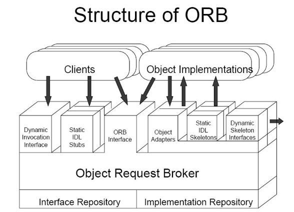

# 4주차 과제
## CORBA의 ORB 중심의 구조와 구성요소들을 기능을 요약하고, 응용 객체들 간의 통신이 이루어지는 과정을 설명하시오.

CORM(Common Object Request Broker Architecture) 란 OMA(Object Management Architecture) 에서 정의한 규격으로 오브젝트 기반 환경의 표준안이라고 할 수 있습니다. 특히 CORMA의 ORB가 컴퓨터 H/W 의 내부 버스처럼 프로그램 사이에서도 서로의 위치에 관계없이 서로를 사용할 수 있는 기능을 제공합니다.  

[그림 1] ORB 구조  

ORB(Object Request Brokers)는 CORBAservices, CORBAfacilities와 애플리케이션 오브젝트들 사이에서의 연결 통로를 제공하는 역할을 합니다. 내부 구조는 [그림 1]과 같이 되어 있으며 Client 들이 서버의 Object Implementation들에게 request를 보내고 반대로 Object Implementation 들이 Client들에게 Reply를 보내는 연결 통로를 제공하는 것을 확인할 수 있습니다. 

### ORB Interface
ORB Interface를 통해서 Client와 Object Implementation이 서로 Message를 주고 받게 됩니다.   

### Interface Repository
Object Implementations을 개발한 개발자는 IDL로 기술한 인터페이스를 Interface Repository에 저장해 둡니다.   

### Static IDL Stubs
Client는 Interface Repository에 저장된 Interface를 가져다가 본인의 프로그램과 링크를 해서 Static IDL Stubs을 미리 만들어 놓게 됩니다. 이는 분산의 투명성을 제공하고 Marshaling(한 줄로 맞추어 나열해서 세우는 것, 표준화/구조화 되어 있는 데이터들을 Packing 하는 것)을 하게 됩니다. 이 Stub들은 클라이언트 별로 여러 개가 생성됩니다.  

### Dynamic Invocation Interface
 Dynamic Invocation Interface는 사전에 만들어져 있는 Stub을 사용하는 것이 아니라 실행 시간 중에 Interface Repository에서 interface를 가져다가 동적으로 Request Message를 만들어 주는 역할을 합니다. Client가 언제든지 네트워크를 통해 접속할 수 있는 Obejct에 대한 호출 및 작동 능력을 부여하게 됩니다. 
동적 호출 시 4단계를 거치게 되는데 그 과정은 다음과 같습니다. 1. Object 식별 2. Interface 검색 3. 호출 구성 4. Request를 보내고 Receive Result를 받는다.   

### Implementation Repository
Object Implementation에 대한 정보를 저장하고 있는 장소로 저장, 수정, 검색될 것으로 예상되는 모든 Object에 대한 IDL 정의가 수행됩니다.  
ORB가 IR을 사용하는 경우는 3가지가 있는데 다음과 같습니다.   
1.	서로 다른 ORB implementation 간의 상호 운용성을 제공하기 위해
2.	Dynamic Invocation Interface를 통한 요청인지, Static IDL Stubs을 통한 요청인지 유형 확인
3.	상속 그래프의 정확성을 확인하기 위해  

### Object Adapters
서버 기기에 있는 Object Implementations에 대한 생명주기를 관리해주는 역할을 합니다. 어떤 Implementation이 활성화 되어 있는지, 그것이 어느 기기에 있는지, Implementation에 대한 정보를 Implementation Repository에 저장을 합니다. Request Message를 만들 때 해당되는 implementation 구현 물이 어디에 있는가를 알기 위해서 참조 주소 값을 알아낼 때 사용합니다.   

### CORBA services
 생명주기 및 관계 서비스, 영구 객체 및 외부화 서비스, 이름 지정 및 거래 서비스, 이벤트 서비스, 거래 및 동시성 서비스, Property 및 Query 서비스, 보안 및 라이센스 서비스 등을 제공합니다.  

### CORBA facilities
-	수평적
사용자 인터페이스, 정보 관리, 시스템 관리, Task 관리 등 
-	수직적
헬스 케어, 전기 통신, 금융 서비스 등 

