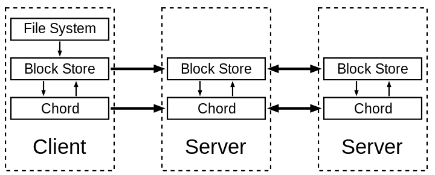
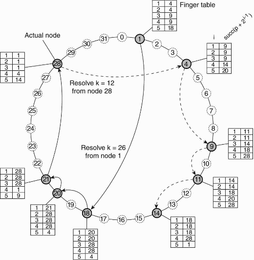
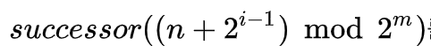
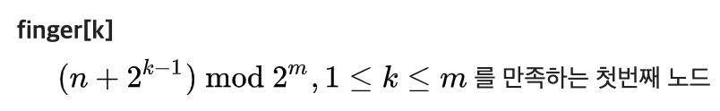

# 5주차 과제
## DHT(Distributed Hash Table)을 이용하는 Chord 탐색 프로토콜의 동작 과정을 설명하시오.
Chord 탐색 프로토콜이란 peer-to-peer DHT(분산 해시 테이블)에 대한 프로토콜 및 알고리즘입니다. 

 
[그림 1] Chord 

DHT(Distributed Hash Table)란 분산 해시 테이블로 분산 시스템에서 굉장히 많이 사용되는 방법입니다. 블록 체인 등 P2P 환경에서 가장 문제가 되는 것이 내가 원하는 데이터를 클라이언트-서버 환경에서는 모두가 가지고 있지만 P2P 환경에서는 누가 가지고 있는지를 모른다는 것입니다. 즉 내가 원하는 데이터를 찾아야 하는데 그 데이터를 누가 가지고 있는지를 어떻게 빨리 찾을 수 있을지가 관건이고, 그 해결 방안으로 분산 해시 테이블을 사용하는 방법이 있습니다. P2P 환경에서 자주 나오고 굉장히 중요합니다.   

 
[그림 2] DHT 

`[그림 2]`과 함께 보면서 동작 과정을 살펴 보겠습니다. 링 형태로 되어 있고 0부터 31번까지 총 32개의 데이터가 있다고 생각하면 됩니다. 1, 4, 9, 11, 14, 18, 20, 21, 28번의 9개 노드는 실제 peer-computer들이고 32개의 파일을 나누어 가지고 있는 형태입니다. 예를 들어 1번 노드 컴퓨터는 29, 30, 31, 0, 1번 파일을 가지고 있는 것입니다. 이 그림은 1번 노드 컴퓨터에서 26번 키를 찾아가는 과정을 나타낸 것입니다. 시계 방향으로만 이동하는 경우를 가정한 상황입니다.  

 
[그림 3] successor 식 

 
[그림 4] finger table 식 

 빠르게 찾아가기 위해 Finger table을 사용하게 됩니다. 행이 5개인 이유는 log32, 전체 파일 개수의 log를 취한 값입니다. 그리고 그 5개의 값은 4번 노드의 succ 식을 통해 Finger table이 만들어 지게 됩니다. [그림 3]과 [그림 4]의 식을 통해 테이블이 생성됩니다.   
 Key값이 26일 경우 26보다 크지 않고 26에 가까운 값을 계속해서 찾아나가는 과정을 진행하게 됩니다. 따라서 1번 노드에서는 18번 노드로, 18번 노드에서는 20, 20번 노드에서는 21, 21번 노드에서는 28번 노드로 이동하게 되고, 28번 노드에서 키 값이 26번인 데이터를 찾을 수 있게 됩니다. 이렇게 탐색하는 방법은 O(log(N)) 만큼의 시간 복잡도가 소요되게 됩니다.    

### 참고문헌
[Chord(2020.03)](https://ko.wikipedia.org/wiki/Chord)

