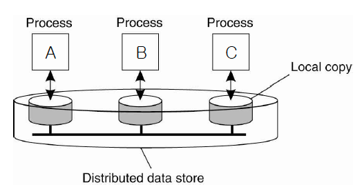
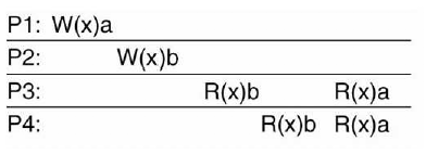
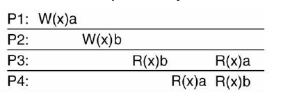
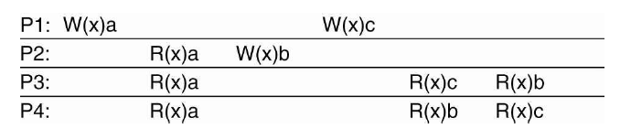

# 6주차 과제
## 순차 일치성(sequential consistency)과 인과 일치성(causal consistency)의 정의를 설명하고 각각을 만족하는 사례를 설명하시오.
아래 그림과 같이 데이터 저장소가 분산되어 있는 경우 local copy와 remote copy의 데이터의 값이 변동(update)되는 경우가 발생할 수 있습니다. 예를 들어 Process A가 데이터의 값을 변경하는 경우 Process B와 C의 데이터의 값도 동일하게 변동이 되어야 합니다. 이렇게 replica에 대한 데이터가 변동되고 그 데이터가 일치하게 되는 시점을 명확하게 하기 위해서 사용되는 방법에는 순차 일치성 sequential consistency와 인과 일치성 causal consistency가 있습니다.   

 
그림 1 Distributed data store 

 

일치성을 구현하기 위해서는 다음 사항들을 고려해야 합니다. 이 사항들은 일치성을 지키기 위한 최상의 조건이나 무조건적으로 지킬 수 있다고 보장하기는 어려울 수 있습니다. 
* Replica들이 가지고 있는 값의 수치를 일치시켜야 합니다. 예를 들어 주식 시장에 경우 거래가 순간적으로 빠르게 이루어지게 됩니다. 이러한 변동 사항들을 그래프로 확인할 수가 있는데 증권거래소, 증권사, 포털 사이트 등에서 모두 같은 변동 그래프를 나타낼 수 있어야 합니다.
* 업데이트된 시간이 너무 오래 경과하게 되면 안됩니다.
지속적으로 복제된 장소에서도 값을 업데이트 할 수 있어야 합니다. 
* 데이터의 업데이트 순서가 동일해야 합니다.
모든 저장소에서 데이터가 업데이트된 순서를 동일하게 가지고 있을 수 있도록 고려해야 합니다.  

### 순차 일치성 sequential consistency
순차 일치성이란 Write Operation의 순서를 일치시키는 방법입니다. 앞에서 예시로 든 주식시장 주가 체결 시 그래프의 변동이 모든 사이트에서 일치해야 하는 경우가 해당됩니다. Execution이 발생하게 되면 모든 복제들이 동일한 순서로 값이 업데이트 되도록 합니다.

 
그림 2 sequential 
 
그림3 not sequential 

   그림 2과 같이 4개의 Process들이 존재하고 Process 1에서 W(x)a가 발생했고 Process 2 에서 W(x)b가 발생했을 경우, Process 3에서 R(x)b를 하고 R(x)a를 하게 됩니다. Process 3에서 b를 먼저 읽었기 때문에 Process 4에서도 b를 먼저 읽고 a를 읽어야 합니다. 그게 순차 일관성 방법의 조건입니다. 따라서 그림 3의 예시에서 Process 4가 a를 먼저 읽게 되었으므로 틀린 예시가 되게 됩니다.   

 
그림 4 순차 일치성 예시 

  순차 일치성의 경우 그림 4과 같은 사례가 발생하게 됩니다. 각 프로세스는 x, y, z 를 1로 쓰고 나머지 (y, z), (x, z), (x, y)를 출력하게 됩니다. 이렇게 될 경우 Read, Write의 발생 순서를 따져 봤을 때 경우의 수가 90가지가 생길 수 있게 됩니다. 따라서 이렇게 많은 경우를 고려해서 실제 운영하기에 어려움이 있을 수 있기 때문에 조금 더 완화된 방식인 인과 일치성이 있습니다. 

### 인과 일치성 causal consistency
  인과 일치성이란 인과관계가 있는 이벤트에 대해서만 순서를 맞추는 경우 입니다. 순서는 있지만 인과관계가 없는 concurrent 이벤트는 예외로 순서를 지키지 않아도 됩니다.  

 
그림 5 인과 일치성 

그림 5를 보시면 4개의 Process가 존재하고 Process 1이 W(x)a한 후 Process 2 가 R(x)a를 했습니다. 그 후 Process 2가 W(x)b를 하게 됩니다. 이 경우 Process 1이 Write 한 것을 Process 2에서 Read 했으므로 인과관계가 생기게 됩니다. 따라서 R(x)a 이후 R(x)b 순서로 업데이트 되어야 합니다. 그러나 Process 1에서 W(x)c한 것과 Process 2에서 W(x)b 한 것은 시간적 차이는 있을 수 있지만 인과관계는 존재하지 않습니다. 따라서 Process 3과 Process 4에서 업데이트 순서가 a 이후 b가 일어나야 하는 건 맞지만 c의 순서는 동일하지 않아도 됩니다. 그러므로 그림 5와 같은 순서도 인과 일치성을 지켰다고 볼 수 있습니다. 
그러나 만일 Process 1이 W(x)c를 하기 전에 R(x)b를 먼저 했을 경우에는 다릅니다. 이 경우에는 인과관계가 생겼기 때문에 R(x)a, R(x)b, R(x)c 순서로 업데이트가 되어야 올바르게 됩니다.   

