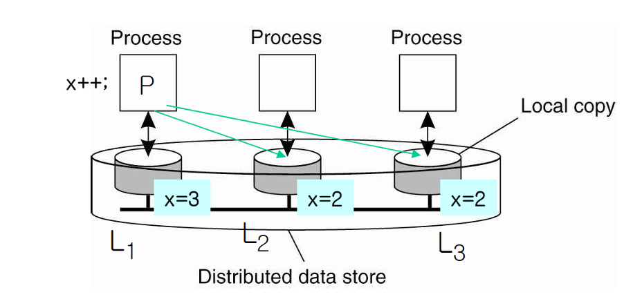
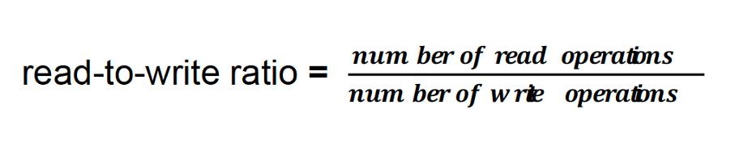
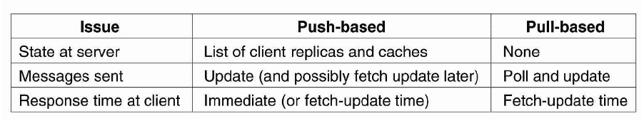

# 7주차 과제
## 복제 관리를 위한 push 와 pull 기법의 장단점을 설명하시오.
분산 시스템에서는 데이터를 여러 replica 들이 가지고 있습니다. 여러 replica 들 사이에서 복제들 간의 일치성을 관리해야 하는 이슈가 발생하게 됩니다. 따라서 이 관리를 일반 애플리케이션 사용자가 아닌 미들웨어 차원에서 관리하는 방법들이 있습니다. replicas는 original contents, server를 의미하고 clients 는 사용자를 의미합니다. 각각 origin server, client에서 init을 하게 되면 server-initiated, client-initiated replicas 라고 하게 됩니다.  

 
그림 1 분산된 데이터 저장소 

그림 1과 같이 L1에서 x++ 연산 작업을 수행하여 x의 값에 변동이 생겼을 때 해당 update를 어떻게 반영 할지에 대한 방법들이 있습니다.  
1.	Invalidation protocols: 값을 변경한 프로세스가 다른 프로세스들에게 값이 update 되었으니 값을 읽어가라고 통보해주는 방법. 
2.	Write Through: 한 프로세스에서 값을 변경할 때 다른 모든 복제들의 해당 값을 다시 Write 해주는 방법. 
3.	Active replication: x++ 라는 operation을 다른 프로세스로 전달하여 값이 update하도록 하는 방법.  

 
그림 2 read-to-write ratio 

Read-to-Write 비율에 따라 어떤 방법이 효과적이고 장/단점을 가지는지 파악할 수 있습니다. 그림 2와 같이 read operation / write operation 으로 계산하게 됩니다. 예를 들어 휴대전화 번호를 바꾸는 경우 이는 흔한 일이 아니기 때문에 자주 연락을 주고 받는 사이일 경우 read operation 수에 비해 write operation 수가 훨씬 적게 됩니다. 따라서 read-to-write ratio는 1보다 훨씬 큰 값이 되게 됩니다. 또 다른 경우를 예로 들어보면 삼성전자의 주가를 확인하는 경우 1초에도 몇 번씩 거래가 일어날 수 있고 그 해당 변동 사항을 다 read할 필요가 없게 됩니다. 따라서 이 경우에는 앞의 예시와 반대로 생각할 수 있게 됩니다.  

 
그림 3 pull vs push protocols 

앞에서 다룬 내용처럼 복제 관리를 위한 방법들처럼 복제들 간 일치성을 관리할 때 server가 data 값을 밀어 넣어주는 Push, client 가 server에게 값을 달라고 요청하는  Pull 이 있습니다.   

Push 기법은 server가 가지고 있는 origin data 값의 copy를 누가 가지고 있는지를 알아야 하기 때문에 빠뜨리지 않기 위해 replica들과 cach들의 리스트를 가지고 있어야 합니다. 값이 update될 때 가능하면 fetch를 수행하게 되고 client의 응답은 즉시 일어나게 됩니다.   

Pull 기법은 read-to-write ratio가 낮을 때와 공유 빈도가 낮을 때 유리합니다. Pull 작업은 클라이언트 요청 시에만 동작하고 서버에서 수행할 일은 별도로 존재하지 않습니다. 하지만 긴 시간동안 pull 이 수행되지 않을 경우 fetch-update가 발생하지 않아 오래된 값이 계속해서 남아있을 수 있게 됩니다.   

