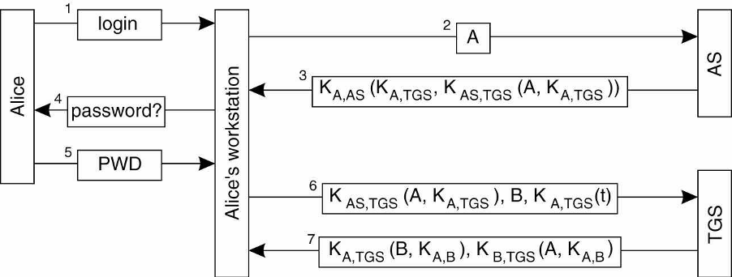

# 10주차 과제
## Kerberos의 목적과 동작 과정을 설명하시오.

커버로스(Kerberos)는 1998, 1994년도에 Needham-Schroeder 인증 프로토콜에 기반을 두고 MIT에서 개발한 표준입니다. 현재 버전은 5까지 나왔습니다. 커버로스의 목적은 인터넷 상에서 여러 클라이언트들과 서버들이 있을 때 그 클라이언트과 서버들 간을 상호 인증 해주기 위한 인증 서비스를 제공하기 위함입니다. 커버로스는 ‘머리가 3개 달린 개’라는 의미를 가진 단어에서 착안한 이름인데, 그 이유는 3번에 걸쳐서 이벤트가 발생되기 때문입니다.   

그림 1 Kerberos

그림1에서 Alice는 사용자를 의미하고, Workstation은 Client Machine에 해당됩니다. 그림 1의 과정을 간단히 보면 왼쪽에서 바라봤을 때 Alice라는 User가 Client Machine에 로그인을 하게 되고 그 다음 비밀번호를 입력하도록 하여 비밀번호 입력 후 로그인이 완료가 됩니다. 오른쪽에서 바라보게 되면 AS(Authentication Server) – 인증 서버가 있고, TGS(Ticket Granting Server) – 티켓을 발급해주는 서비스를 제공하는 서버가 있습니다. 그림에는 없지만 그 밑에 실제 Real Server(실질 서버)가 존재하게 됩니다.   

Alice는 Server B에 요청을 해서 서비스를 받고자 합니다. 그러나 인터넷 상에서는 굉장히 많은 클라이언트들과 서버들이 존재하게 됩니다. Alice는 Server B와 트랜잭션(상거래)를 하려고 한다면 서로의 신원이 확인 되어야 그 작업을 수행할 수 있습니다. 클라이언트 입장에서는 해당 서버가 믿을 수 있는 서버인지 확인 후 개인 정보를 보낼 수 있고, 서버 입장에서도 마찬가지로 클라이언트가 도용을 하진 않았는지 등을 확인해야 합니다. 그런데 이런 인증 과정이 각 클라이언트와 실질 서버에 모두 존재하게 되면 비효율적일 수 있습니다. 그 많고 많은 클라이언트와 서버들은 모두 이 인증과정을 필요로 하기 때문입니다. 따라서 인터넷 상의 인증 서비스를 제공해주는 커버로스에 인증 서버가 존재하게 됩니다. 따라서 사전에 서비스를 이용하고자 하는 모든 클라이언트들과 모든 서버들은 이 인증 서버에 가입이 되어 있어야 합니다.   

### 동작 과정

1.	제일 먼저 Alice가 Workstation을 통해서  

2.	인증 서버에게 ID를 전달하여 인증을 요청을 합니다.  

3.	인증 서버는 결과를 반환을 하는데 전체의 내용이 Alice와 인증 서버만 알고 있는 공유 비밀 키(K-A,AS) 로 암호화되어 있습니다. 이는 기밀성을 보장할 수 있습니다. Alice와 티켓 발급 서버만 알고 있는 키(K-A,TGS)와 인증 서버와 티켓 발급 서버의 공유 비밀 키(K-AS,TGS)  로 A와 K-A,TGS 키 값을 암호화해서 보내게 됩니다. 여기에서  K-AS(TGS(A,K-A,TGS))부분을 티켓이라고 부릅니다. 티켓이라고 하는 것은 인증 서버가 Alice에게 내용을 보도록 하는 것이 아니고, 가지고 있다가 TGS 제시하도록 하는 용도입니다.  

4.	Alice에게 비밀번호를 요청합니다. Workstation에서 확인을 하는 과정입니다.  

5.	PWD는 실제 비밀번호로, 이 결과 값은 Workstation에서 확인합니다.  

6.	인증 서버가 준 티켓 K-AS(TGS(A,K-A,TGS)), B(대화하고 싶은 실질 서버), t(random number or time)값을 Alice와 티켓 발급 서버만 알고 있는 키(K-A,TGS)로 암호화 한 값을 티켓 발급 서버에 전달합니다. TGS는 A가 전달한 티켓이 유효한지 확인합니다. 인증 서버에서 이미 인증을 진행했기 때문에 A에 대한 인증을 다시 수행하지는 않습니다. 인증 서버와 티켓 발급 서버의 비밀 키와 Alice와 티켓 발급 서버의 비밀 키를 통해 Alice를 확인하게 됩니다.  

7.	티켓 발급 서버에서 반환하는 내용을 보면 Alice와 티켓 발급 서버의 공유 비밀 키 를 통해 실질 서버 B와 Alice와 실질 서버 B의 공유 비밀 키 를 암호화하여 보냅니다. 그리고 그 뒤에  부분은 티켓 발급 서버가 발급한 서버 B에 제시할 티켓에 해당됩니다.  

8.	Alice의 Workstation이 서버 B에게 티켓 발급 서버가 발급한 티켓을 제시하고, 서버에게 요청할 Request Message를 Alice와 실질 서버 B의 공유 비밀 키 를 통해 암호화해서 주고 받게 됩니다.  
